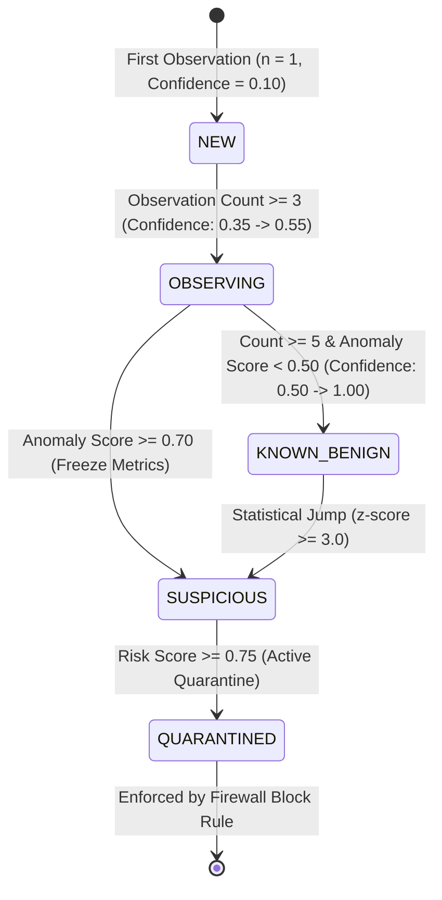
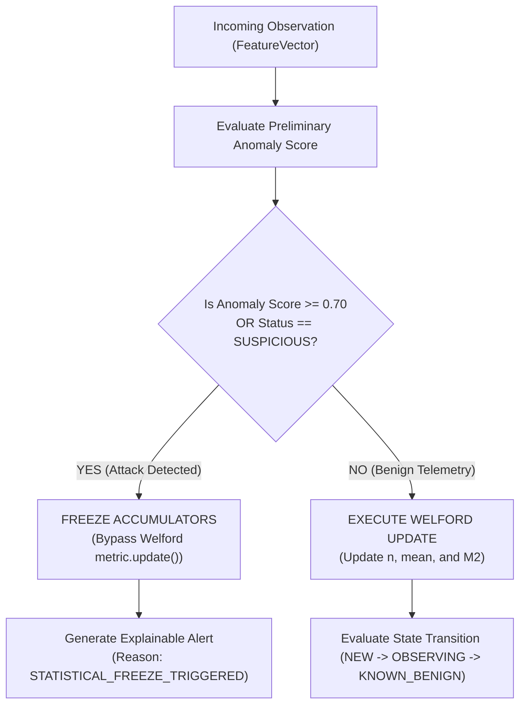

# Sentinel AI Firewall — Adaptive Learning & Online Baselining

## 1. Executive Summary

Sentinel AI Firewall implements an offline, continuous self-learning behavioral baseline engine (`BehavioralBaselineEngine`). The engine constructs historical normative profiles for host process-endpoint relationships using **Welford's Algorithm** for single-pass online statistical accumulation.

The architecture ensures that host endpoints adapt to legitimate user workflows in real time without human policy intervention, while strictly defending against **adversarial baseline poisoning** through mathematical state transitions and statistical freezes.

---

## 2. Mathematical Foundation: Welford's Algorithm

Path: `backend/security/baseline.py` (`BaselineMetric`)

### 2.1 The Numerical Stability Problem
Naïve online variance calculation computes $\sum x_i$ and $\sum x_i^2$, which suffers from catastrophic cancellation errors when floating-point numbers are large or variances are small:

$$\sigma^2 = \frac{\sum x_i^2 - \frac{(\sum x_i)^2}{n}}{n-1} \quad \text{(Susceptible to floating-point truncation)}$$

### 2.2 Welford's Recurrence Formulation
Welford's algorithm computes the running sample mean $\bar{x}_n$ and the sum of squared differences from the mean $M_{2,n}$ in a single pass with optimal numerical stability and $O(1)$ memory:

$$\bar{x}_n = \bar{x}_{n-1} + \frac{x_n - \bar{x}_{n-1}}{n}$$

$$M_{2,n} = M_{2,n-1} + (x_n - \bar{x}_{n-1})(x_n - \bar{x}_n)$$

$$\sigma_n^2 = \begin{cases} 
0.0 & \text{if } n < 2 \\ 
\frac{M_{2,n}}{n - 1} & \text{if } n \ge 2 
\end{cases}$$

$$\sigma_n = \sqrt{\sigma_n^2}$$

### 2.3 Complexity Characteristics
- **Time Complexity per Observation**: $O(1)$ (independent of historical event count).
- **Space Complexity per Metric**: $O(1)$ (stores only 3 scalar values: $n$, $\bar{x}$, $M_2$).
- **Total Memory for 26 Features**: $\approx 624\text{ bytes}$ per tracked behavioral identity.

---

## 3. Behavioral Identity Scoping

To avoid catastrophic over-generalization while preventing memory explosion, the identity key is canonically scoped as:

$$\text{behavior\_identity\_key} = \text{process\_name} \mid \text{executable\_id} \mid \text{remote\_target} \mid \text{protocol} \mid \text{direction}$$

```text
Example 1 (Web Browser):
chrome.exe|C:\Program Files\Google\Chrome\chrome.exe|142.250.190.46:443|TCP|OUTBOUND

Example 2 (Suspicious Script):
powershell.exe|C:\Windows\System32\WindowsPowerShell\v1.0\powershell.exe|192.168.1.50:4444|TCP|OUTBOUND
```

---

## 4. Learning State Machine Lifecycle

Every tracked behavioral identity progresses through a strict multi-stage lifecycle based on observation count and statistical stability.



### 4.1 Stage Specifications

| State | Entry Condition | Confidence | Accumulator Behavior |
| :--- | :--- | :---: | :--- |
| **`NEW`** | First observation ($n < 3$) | $0.10\text{--}0.25$ | Accumulators initialized; anomalies flagged with low confidence. |
| **`OBSERVING`** | $3 \le n < 5$ | $0.35\text{--}0.55$ | Active accumulation; statistical distribution stabilizes. |
| **`KNOWN_BENIGN`**| $n \ge 5$ AND historical $\text{anomaly} < 0.5$ | $0.50\text{--}1.00$ | Baseline fully matured; updates occur with decayed weight. |
| **`SUSPICIOUS`** | Current event $\text{anomaly} \ge 0.70$ OR $z \ge 3.0$ | Inherited | **STATISTICAL FREEZE**: Metric updates bypassed. |
| **`QUARANTINED`** | Confirmed threat / risk score $\ge 0.75$ | High ($> 0.85$) | **PERMANENT FREEZE**: Isolated from baseline memory. |

---

## 5. Adversarial Baseline Poisoning Protections

Adversaries often attempt **slow-drip poisoning attacks**, slowly increasing beacon frequencies or exfiltration volumes by small increments to train the baseline to accept malicious behavior.



### 5.1 The Three Core Defense Rules
1. **Unvalidated Observation Safeguard**: Newly created profiles (`NEW`) undergo a mandatory observation quarantine before their statistics are considered authoritative.
2. **Dynamic Statistical Freeze**: If an incoming feature vector produces an anomaly score $\ge 0.70$, the baseline accumulators for that identity are **immediately frozen**. The malicious payload cannot alter $\bar{x}$ or $\sigma^2$.
3. **Decoupled Confidence Metric**: Anomaly score ($A \in [0, 1]$) and detection confidence ($C \in [0, 1]$) are calculated independently. A high-confidence benign event is never confused with a low-confidence unknown event.

---

## 6. Deviation Scoring: The $z$-Score Evaluator

To determine how far an observed feature $x_i$ deviates from its learned historical distribution:

$$z_i = \begin{cases} 
0.0 & \text{if } \sigma_i = 0 \text{ or } n < 2 \\ 
\frac{|x_i - \bar{x}_i|}{\sigma_i} & \text{if } \sigma_i > 0 
\end{cases}$$

The feature-level deviation score $d_i \in [0.0, 1.0]$ is computed using a logistic sigmoid scaling:

$$d_i = \frac{2}{1 + e^{-0.5 \cdot z_i}} - 1$$

- $z_i = 0.0 \implies d_i = 0.0$ (Perfect match to baseline).
- $z_i = 2.0 \implies d_i \approx 0.46$ (Moderate deviation).
- $z_i = 3.5 \implies d_i \approx 0.72$ (Significant anomaly).
- $z_i \ge 5.0 \implies d_i \approx 0.92$ (Extreme anomaly / attack).

---

## 7. Baseline Memory Management & LRU Eviction

To enforce the hard $< 150\text{ MB}$ memory ceiling, the baseline engine enforces a bounded capacity:
- **Maximum Tracked Identities**: $20,000$ concurrent records.
- **Eviction Strategy**: Least Recently Used (LRU) based on `last_seen_timestamp`.
- **Exemption Rule**: Records in `KNOWN_BENIGN` with $n \ge 100$ are persisted to local cache before eviction.
