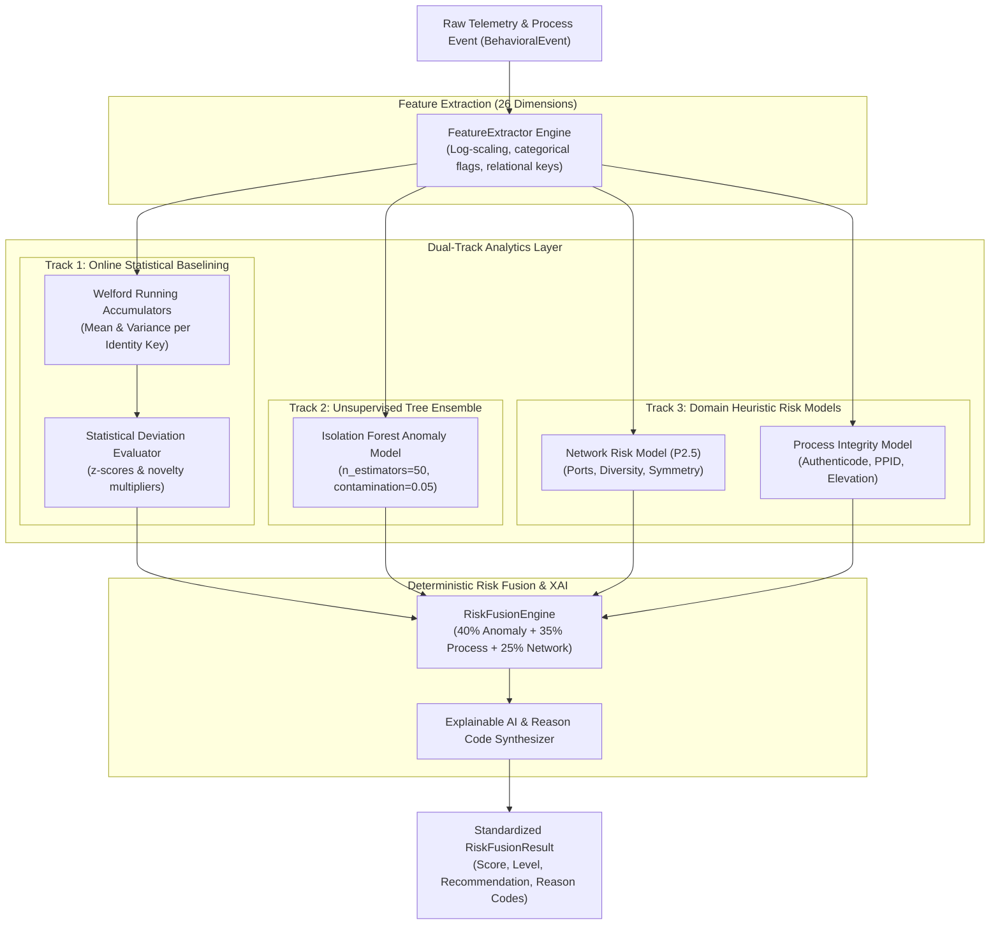
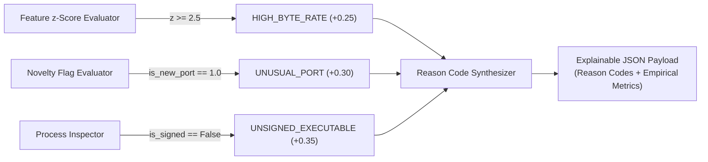

# Sentinel AI Firewall — AI & Machine Learning Architecture

## 1. AI Philosophy & Guiding Principles

The artificial intelligence subsystem of Sentinel AI Firewall is designed specifically for host endpoint defense, operating under five foundational engineering tenets:

```mermaid
mindmap
  root((AI Architecture Principles))
    Offline-First & Sovereign
      Zero cloud dependency
      Zero telemetry exfiltration
      Air-gap compliant
    Ultra-Low Latency & Footprint
      Sub-millisecond inference
      < 120 MB RAM footprint
      O(1) memory Welford accumulators
    Deterministic & Non-Black-Box
      Mathematical bounds [0.0, 1.0]
      No stochastic hallucinations
      Empirically verifiable
    Explainable AI (XAI)
      Granular reason codes
      Empirical z-score attribution
      Transparent decision trees
    Adversarial ML Resilient
      Statistical freeze on anomalies
      Phased state maturation
      Poisoning immunity
```

---

## 2. Model Taxonomy & Pipeline Overview



---

## 3. Feature Engineering & The 26 Canonical Metrics

Path: `backend/security/features.py` (`FEATURE_VERSION = "1.0"`)

The `FeatureExtractor` maps incoming `BehavioralEvent` objects into a normalized 26-dimensional floating-point vector suitable for linear accumulators and tree-based ML models.

### 3.1 Feature Catalog & Transformation Matrix

| Index | Feature Name | Category | Transformation / Formula | Purpose |
| :---: | :--- | :--- | :--- | :--- |
| `0` | `process_frequency` | Process | Normalized calls / min | Detects rapid process spawning loops |
| `1` | `process_lifetime_sec` | Process | Continuous seconds | Distinguishes ephemeral scripts from long daemons |
| `2` | `has_parent_process` | Process | $1.0 \text{ if PPID present, else } 0.0$ | Identifies orphan or root-injected processes |
| `3` | `signed_status_val` | Process | $1.0 = \text{Valid}, 0.0 = \text{Unsigned}, 0.5 = \text{Unknown}$ | Cryptographic Authenticode trust weight |
| `4` | `connection_frequency` | Network | Outbound connections / min | Detects port scanning or C2 heartbeat bursts |
| `5` | `unique_destinations_count`| Network | Unique IP count in observation window | Detects lateral scanning & worm propagation |
| `6` | `unique_ports_count` | Network | Unique destination ports accessed | Detects port scanning activity |
| `7` | `bytes_sent_log` | Network | $\log_e(1 + \text{bytes\_sent})$ | Log-normalizes high dynamic range outbound data |
| `8` | `bytes_received_log` | Network | $\log_e(1 + \text{bytes\_received})$ | Log-normalizes inbound payload volume |
| `9` | `inbound_outbound_ratio` | Network | $\frac{\text{bytes\_in}}{\text{bytes\_in} + \text{bytes\_out} + 1}$ | Identifies exfiltration vs normal downloading |
| `10` | `failed_connection_rate` | Network | $\frac{\text{failed\_attempts}}{\text{total\_attempts}}$ | Detects dead-host scanning & blocked beacons |
| `11` | `proto_tcp` | Network | $1.0 \text{ if TCP, else } 0.0$ | One-hot protocol indicator |
| `12` | `proto_udp` | Network | $1.0 \text{ if UDP, else } 0.0$ | One-hot protocol indicator |
| `13` | `proto_icmp` | Network | $1.0 \text{ if ICMP, else } 0.0$ | One-hot protocol indicator |
| `14` | `proto_other` | Network | $1.0 \text{ if raw/unknown, else } 0.0$ | Detects unusual raw socket protocols |
| `15` | `direction_inbound` | Network | $1.0 \text{ if Inbound, else } 0.0$ | Identifies unsolicited inbound listening |
| `16` | `direction_outbound` | Network | $1.0 \text{ if Outbound, else } 0.0$ | Identifies initiated outbound egress |
| `17` | `direction_unknown` | Network | $1.0 \text{ if Unknown, else } 0.0$ | Handles incomplete socket metadata |
| `18` | `state_established` | Network | $1.0 \text{ if ESTABLISHED, else } 0.0$ | Active socket state |
| `19` | `state_listen` | Network | $1.0 \text{ if LISTENING, else } 0.0$ | Detects newly opened listening ports |
| `20` | `state_other` | Network | $1.0 \text{ if SYN\_SENT/TIME\_WAIT, else } 0.0$| Ephemeral socket state indicator |
| `21` | `is_new_destination` | Novelty | $1.0 \text{ if first seen IP, else } 0.0$ | Flags first-time remote targets |
| `22` | `is_new_port` | Novelty | $1.0 \text{ if first seen port, else } 0.0$ | Flags unusual destination ports for process |
| `23` | `is_new_protocol` | Novelty | $1.0 \text{ if unexpected proto, else } 0.0$| Flags unexpected transport protocols |
| `24` | `is_new_process_net_rel`| Novelty | $1.0 \text{ if first network event for proc}$ | Identifies non-network tools suddenly calling out |
| `25` | `is_first_seen_behavior`| Novelty | $1.0 \text{ if identity key is NEW}$ | Global cold-start indicator |

---

## 4. Machine Learning Model Architecture: Isolation Forest

Path: `backend/security/anomaly.py` (`IsolationForestAnomalyModel`)

The Isolation Forest algorithm isolates anomalies by randomly partitioning feature space with orthogonal hyperplanes. Anomalies require fewer partitions to isolate than normal clustered points.

### 4.1 Hyperparameter Specifications
- `n_estimators`: `50` (Optimized for sub-millisecond execution and $< 30\text{ MB}$ memory).
- `contamination`: `0.05` (5% expected baseline anomaly threshold).
- `max_samples`: `'auto'` ($\min(256, n)$).
- `random_state`: `42` (Deterministic seed for reproducible evaluation).

### 4.2 Score Normalization & Output Contract
The raw decision function score $s \in [-0.5, 0.5]$ is mapped to a bounded interval $[0.0, 1.0]$:

$$\text{ml\_score} = \text{clamp}\Big(0.5 - s,\; 0.0,\; 1.0\Big)$$

---

## 5. Explainable AI (XAI) & Reason Code Extraction

Unlike black-box neural networks, Sentinel AI Firewall extracts transparent empirical reasons for every score computation.



### 5.1 Standardized Reason Code Catalog

| Reason Code | Trigger Condition | Severity Impact |
| :--- | :--- | :--- |
| `UNSIGNED_EXECUTABLE` | Binary lacks valid Authenticode signature | $+0.35\text{ Process Risk}$ |
| `UNKNOWN_PUBLISHER` | Certificate missing verified publisher name | $+0.20\text{ Process Risk}$ |
| `ELEVATED_PROCESS` | Process runs with High/System integrity token | $+0.15\text{ Process Risk}$ |
| `HIGH_RISK_PORT` | Target port in $\{22, 23, 135, 139, 445, 3389, 4444, 6667, 8080\}$ | $+0.30\text{ Network Risk}$ |
| `NEW_DESTINATION` | Remote IP never previously contacted by process | $+0.15\text{ Novelty Score}$ |
| `UNUSUAL_PORT` | Remote port never previously contacted by process | $+0.20\text{ Novelty Score}$ |
| `ANOMALOUS_BYTE_RATE` | `bytes_sent_log` exceeds running mean by $> 3\sigma$ ($z \ge 3.0$) | $+0.35\text{ Statistical Score}$ |
| `BURST_FREQUENCY` | Connection frequency exceeds running baseline by $> 3\sigma$ | $+0.25\text{ Statistical Score}$ |
