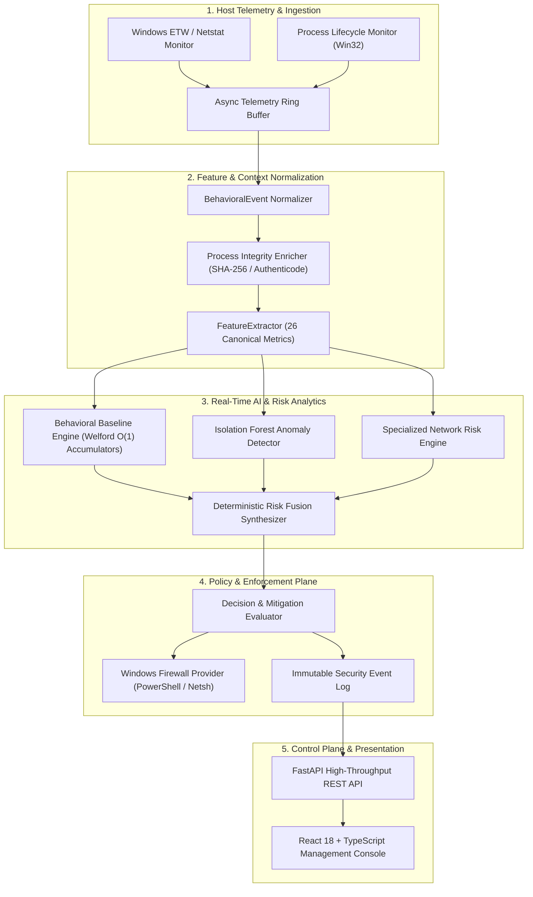
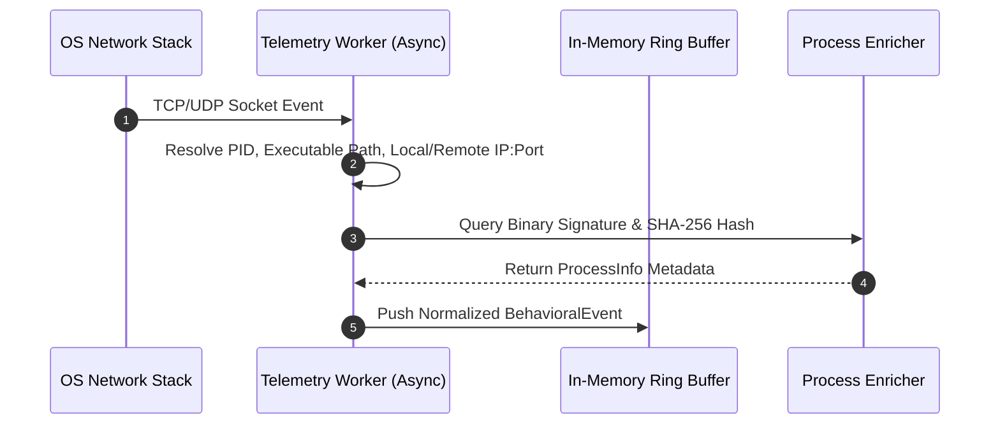
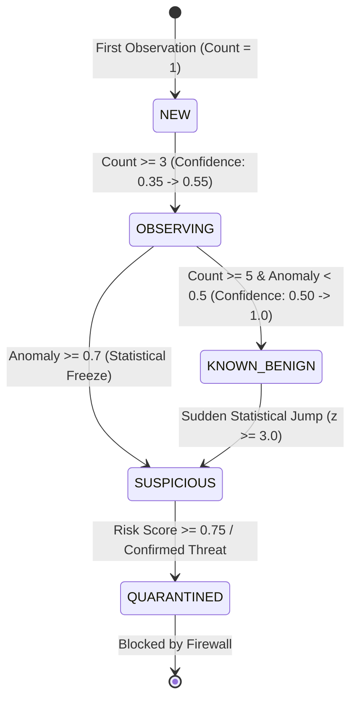
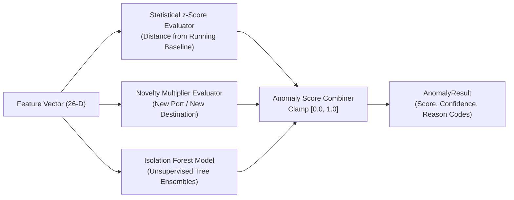
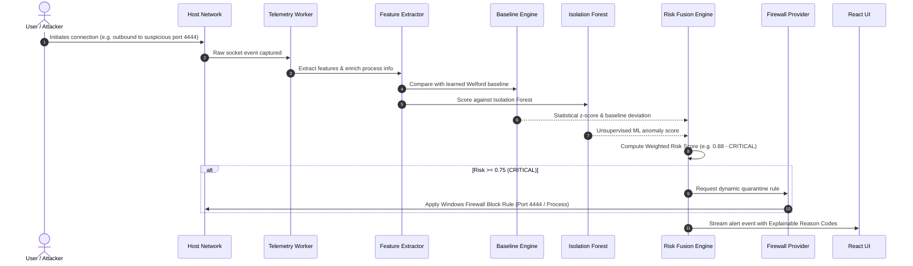

# Sentinel AI Firewall — System Architecture

## 1. Executive Architecture Summary

Sentinel AI Firewall is an autonomous, local-first endpoint defense platform built for high-throughput, low-latency behavioral security monitoring on modern operating systems. The architecture decouples telemetry capture from analytics and policy enforcement through asynchronous pipelines, ensuring that security evaluation never blocks host network I/O or degrades user experience.

---

## 2. Core Architectural Subsystems

### 2.1 Host Telemetry & Network Monitoring Subsystem

The telemetry layer continuously discovers network sockets, active TCP/UDP connections, and process lifecycle events.

- **Connection Sniffing & Sampling**: Utilizes native OS hooks (`pywin32`, socket inspection, and Windows IP Helper APIs) to sample active network connections without injecting disruptive kernel drivers.
- **Process Attribution**: Each connection is immediately bound to its owning Process Identifier (PID), parent PID (PPID), binary image path, Authenticode digital signature status, and user token elevation level.
- **Ring Buffer Ingestion**: Events are queued into an in-memory bounded ring buffer (`TelemetryService`), guaranteeing bounded memory usage ($< 50\text{ MB}$) regardless of connection flood conditions.

---

### 2.2 Feature Normalization Subsystem (`FeatureExtractor`)

The Feature Extraction subsystem converts raw socket telemetry and process metadata into a deterministic 26-dimensional numerical vector and relational metadata payload.

#### Behavioral Identity Key Formula
To avoid overfitting and uniquely isolate process behaviors across target endpoints, the system generates a canonical identity string:

$$\text{behavior\_identity\_key} = \text{process\_name} \mid \text{executable\_id} \mid \text{remote\_target} \mid \text{protocol} \mid \text{direction}$$

Where:
- $\text{executable\_id} = \text{executable\_hash} \lor \text{executable\_path} \lor \text{"unknown"}$
- $\text{remote\_target} = \text{remote\_ip} : \text{remote\_port}$

#### Feature Matrix Breakdown (26 Numerical Dimensions)
1. **Process Features (4)**:
   - `process_frequency`: Normalized execution/connection invocation rate.
   - `process_lifetime_sec`: Total uptime duration in seconds.
   - `has_parent_process`: Binary flag indicating non-root initiation.
   - `signed_status_val`: Digital signature validity ($1.0 = \text{Signed Valid}, 0.0 = \text{Unsigned}, 0.5 = \text{Unknown}$).
2. **Network Dynamics (17)**:
   - `connection_frequency`: Invocations per minute.
   - `unique_destinations_count`: Distinct remote IP count observed.
   - `unique_ports_count`: Distinct destination ports accessed.
   - `bytes_sent_log`: $\log(1 + \text{bytes\_sent})$
   - `bytes_received_log`: $\log(1 + \text{bytes\_received})$
   - `inbound_outbound_ratio`: Directional volume balance ($[0.0, 1.0]$).
   - `failed_connection_rate`: Socket failure ratio.
   - Protocol one-hot flags: `proto_tcp`, `proto_udp`, `proto_icmp`, `proto_other`.
   - Direction one-hot flags: `direction_inbound`, `direction_outbound`, `direction_unknown`.
   - Socket state one-hot flags: `state_established`, `state_listen`, `state_other`.
3. **Novelty & Relational Indicators (5)**:
   - `is_new_destination`, `is_new_port`, `is_new_protocol`, `is_new_process_net_rel`, `is_first_seen_behavior`.

---

### 2.3 Behavioral Baseline Engine (`BehavioralBaselineEngine`)

The baseline engine maintains statistical memory for each observed `behavior_identity_key` using **Welford's Algorithm** for single-pass, online calculation of running mean ($\bar{x}_n$) and variance ($M_{2,n}, \sigma_n^2$).

#### Poisoning Mitigation & Statistical Freeze
When an incoming event registers an anomaly score $\ge 0.7$ or is classified as `SUSPICIOUS`, the engine **freezes** metric accumulators. This prevents active adversarial bursts, port scans, or data exfiltration attempts from skewing the statistical baseline.

---

### 2.4 Hybrid Anomaly Detection Subsystem

The anomaly detector evaluates incoming events against both the running statistical baseline and an offline-trained scikit-learn `IsolationForest`.

---

### 2.5 Deterministic Risk Fusion Engine

The Risk Fusion Engine deterministically aggregates three disparate security vectors:
1. **Anomaly Score ($A$)** (40% Weight): Statistical and ML deviation.
2. **Process Risk ($P$)** (35% Weight): Code signing status, publisher trustworthiness, token elevation, and path anomalies.
3. **Network Risk ($N$)** (25% Weight): Destination port risk (C2/RDP/SMB), IP reputation, and traffic volume asymmetry.

$$\text{RiskScore} = \text{clamp}\Big(0.40 \cdot A + 0.35 \cdot P + 0.25 \cdot N,\; 0.0,\; 1.0\Big)$$

#### Action Thresholds
- $\text{RiskScore} \in [0.00, 0.24]$: **LOW** $\to$ `Allow`
- $\text{RiskScore} \in [0.25, 0.49]$: **MEDIUM** $\to$ `Monitor`
- $\text{RiskScore} \in [0.50, 0.74]$: **HIGH** $\to$ `Warn` (Observation mode) / `Prompt`
- $\text{RiskScore} \in [0.75, 1.00]$: **CRITICAL** $\to$ `Block` & Automated Firewall Quarantine

---

### 2.6 Windows Firewall Provider Subsystem (`WindowsFirewallProvider`)

The firewall service acts as the execution arm of the system, interfacing with the native Windows Advanced Security Firewall via PowerShell and `netsh advfirewall`.

- **Strict Input Validation**: Validates rule names, IP ranges, port lists (0–65535), and protocols against strict regex patterns (`^[a-zA-Z0-9_\-\. ]+$`) to prevent command injection.
- **Idempotency**: Verifies existing rule presence before creation or modification to avoid duplicate rule clutter.
- **Rollback Safety**: Maintains an audit log of all dynamically injected rules, allowing instantaneous single-click removal or emergency system unblocking.

---

### 2.7 Control Plane & REST API Subsystem

Built with **FastAPI**, the control plane provides async endpoints for dashboard consumption and external integrations:
- `POST /analyze/`: Real-time text/connection heuristic classification.
- `GET /events/`: Paginated query interface for recent normalized security events.
- `GET /events/stats`: Global telemetry throughput and memory statistics.
- `GET /events/baseline`: In-memory inspection of learned behavioral identities and Welford accumulators.
- `GET /firewall/rules`: Current Windows Firewall rule inventory inspection.
- `POST /firewall/rules`: Validated rule insertion and enforcement.

---

### 2.8 Frontend Dashboard Subsystem

A responsive, glassmorphic Single Page Application (SPA) built using React 18, TypeScript, and Vite.
- **Dashboard View**: Real-time KPI cards, threat volume charts, and active alert streams.
- **Firewall Rules Manager**: Live table of Windows Firewall rules with toggle switches, search filters, and rule addition dialogs.
- **Network Device Map**: Visual representation of connected endpoints, active socket bindings, and threat statuses.
- **AI Assistant**: Natural language copilot enabling conversational investigation of recent security anomalies and rule suggestions.

---

## 3. Data Flow & Execution Sequence

---

## 4. Concurrency & Resource Budgeting

| Subsystem | Execution Model | Memory Ceiling | Max CPU Target |
| :--- | :--- | :--- | :--- |
| **Telemetry Capture** | Async background loop (`asyncio`) | $< 35\text{ MB}$ | $< 0.8\%$ |
| **Feature Extraction** | Pure Python + NumPy | $< 15\text{ MB}$ | $< 0.3\%$ |
| **Baseline Engine** | In-Memory Dictionary of Accumulators | $< 25\text{ MB}$ | $< 0.2\%$ |
| **Isolation Forest** | Scikit-learn offline loaded model | $< 30\text{ MB}$ | $< 0.2\%$ |
| **FastAPI REST API** | Uvicorn Async Worker | $< 40\text{ MB}$ | $< 0.5\%$ |
| **Total System Target** | **Integrated Host Profile** | **$< 150\text{ MB}$** | **$< 2.0\%$** |
