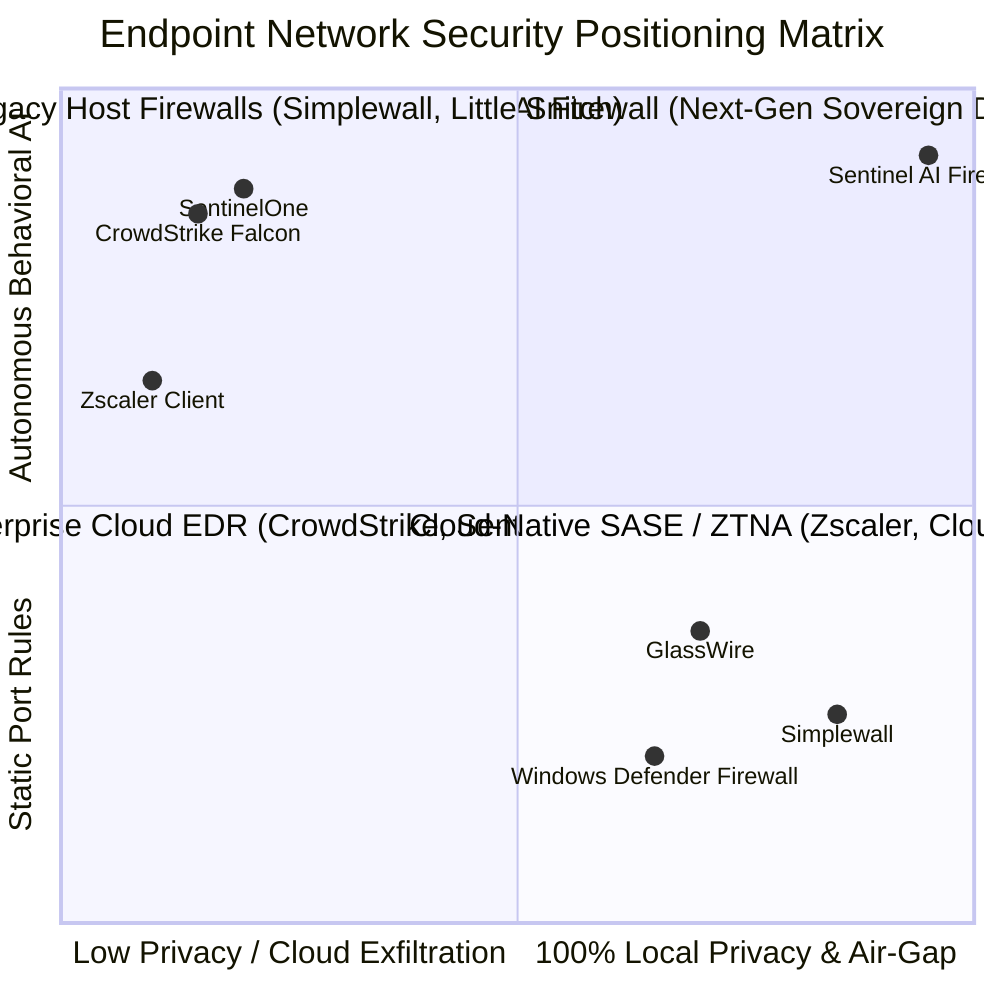
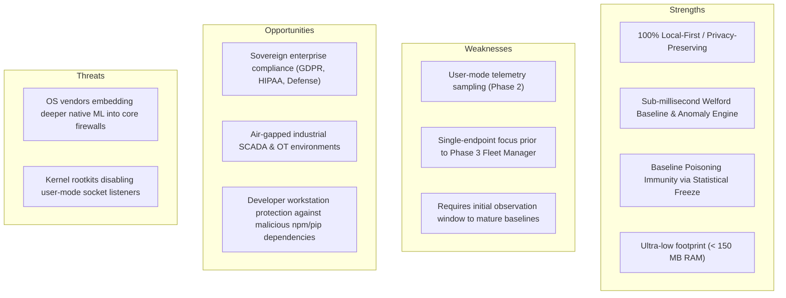

# Sentinel AI Firewall — Competitive Analysis & Market Landscape

## 1. Executive Summary

As enterprise cyber threats transition toward fileless malware, Living-off-the-Land Binaries (LOLBins), and encrypted command-and-control (C2) communication, traditional static firewalls and resource-heavy cloud EDR agents present significant architectural limitations.

**Sentinel AI Firewall** establishes a novel category: **Local-First, Autonomous Behavioral Endpoint Firewalls**. It bridges the gap between dumb static port filters and intrusive, cloud-dependent EDR solutions by executing real-time statistical baselining and unsupervised ML entirely on the local host.

---

## 2. Competitive Landscape Taxonomy

---

## 3. Comprehensive Feature Comparison Matrix

| Feature Dimension | Sentinel AI Firewall | Windows Defender Firewall | GlassWire / Simplewall | CrowdStrike Falcon / SentinelOne | Cloudflare One / Zscaler |
| :--- | :---: | :---: | :---: | :---: | :---: |
| **Telemetry Sovereignty & Privacy** | **100% Local (Zero Cloud)** | Local Only | Local Only | Sent to Vendor Cloud | Proxied through Cloud |
| **Air-Gap / Offline Capability** | **Full Functionality** | Full Functionality | Full Functionality | Degraded (Needs Cloud AI) | Completely Inoperable |
| **Adaptive Statistical Baselining** | **Yes (Welford $O(1)$)** | No | No | Server-Side Profiling | Cloud Policy Engine |
| **Zero-Day Anomaly Detection** | **Isolation Forest + $z$-Score**| None (Static Rules) | None | Heavy Neural / Graph | Cloud Threat Feeds |
| **Baseline Poisoning Defense** | **Dynamic Statistical Freeze** | N/A | N/A | Heuristic Cloud Filter | Central Policy Overrides |
| **Resource Overhead** | **$< 150\text{ MB RAM, } < 1.5\%\text{ CPU}$** | Minimal | $\approx 100\text{ MB}$ | $300\text{--}800\text{ MB, } 5\%\text{--}15\%\text{ CPU}$ | $200\text{--}500\text{ MB}$ |
| **Explainable AI (XAI)** | **Granular Empirical Codes** | N/A | Port / Host Details | Opaque Risk Probabilities | Blocked Category Strings |
| **Dynamic Quarantine Generation** | **Automated Local NetFirewall**| Manual | Manual Prompt | Centralized Agent Policy | Cloud Route Revocation |
| **License & Extensibility** | **Open Source (MIT)** | Proprietary OS | Proprietary / Freemium | Closed Enterprise SaaS | Closed Enterprise SaaS |

---

## 4. In-Depth Competitor Breakdown

### 4.1 Traditional Host Firewalls (Windows Defender Firewall, Simplewall, GlassWire)
- **Strengths**: Lightweight, native OS integration, zero telemetry transmission.
- **Vulnerabilities & Limitations**:
  - Entirely reliant on static IP, port, and executable path rules.
  - Blind to behavioral anomalies (e.g., `svchost.exe` suddenly beaconing to a foreign IP on port 4444).
  - High alert fatigue for users required to manually approve every outbound socket.

### 4.2 Cloud-Delivered EDR/XDR (CrowdStrike Falcon, SentinelOne, Microsoft Defender for Endpoint)
- **Strengths**: Deep kernel visibility, massive cloud threat intelligence graphs, enterprise fleet telemetry correlation.
- **Vulnerabilities & Limitations**:
  - **Data Privacy Violations**: Continuous exfiltration of process metadata, filenames, and network telemetry to vendor cloud servers.
  - **High Resource Tax**: Substantial CPU and RAM consumption, frequently causing slowdowns on developer and engineering workstations.
  - **Air-Gap Incompatibility**: Severely degraded detection accuracy when endpoints are disconnected from WAN/Internet.

### 4.3 SASE & Zero Trust Network Access (Cloudflare One, Zscaler)
- **Strengths**: Centralized perimeterless routing, granular identity-aware access policies.
- **Vulnerabilities & Limitations**:
  - Requires all corporate traffic to be backhauled through cloud edge data centers, introducing latency.
  - Ineffective against lateral movement across local subnet devices on the same LAN.

---

## 5. SWOT Analysis: Sentinel AI Firewall

---

## 6. Strategic Moats & Core Differentiators

1. **Mathematical Efficiency ($O(1)$ Welford Baselining)**:
   Sentinel achieves continuous adaptive learning without recording raw historical event logs, enabling months of continuous profiling within $< 25\text{ MB}$ of memory.
2. **Adversarial Poisoning Freeze**:
   Unlike naïve moving averages that can be poisoned by slow-drip attacker beacons, Sentinel freezes metric accumulation immediately upon detecting statistical divergence ($\ge 0.70$).
3. **Transparent Explainability**:
   Every policy decision provides human-auditable reason codes (`UNSIGNED_EXECUTABLE`, `SUSPICIOUS_PORT`, `ANOMALOUS_BYTE_RATE`) and exact empirical $z$-scores.
4. **Air-Gap Ready**:
   Full defensive efficacy is maintained in classified, undersea, aerospace, or air-gapped industrial infrastructure without external connectivity.
