# Sentinel AI Firewall — Production Deployment Guide

## 1. Deployment Topology & Architectures

Sentinel AI Firewall supports three primary deployment configurations:

```mermaid
graph TD
    subgraph Standalone ["1. Standalone Workstation Mode"]
        Host1["Windows Workstation"]
        Core1["Sentinel Core (Windows Service)"]
        UI1["Local Web Management Console"]
        Host1 --- Core1 --- UI1
    end

    subgraph Enterprise ["2. Enterprise Managed Fleet Mode"]
        Host2["Fleet Endpoints (1..N)"]
        Core2["Headless Sentinel Agent"]
        SIEM["Corporate SIEM / Sentinel Collector"]
        Host2 --- Core2 --> SIEM
    end

    subgraph Containerized ["3. Containerized / Lab Evaluation Mode"]
        DockerHost["Docker Windows/Linux Host"]
        BackendContainer["FastAPI Backend Container"]
        FrontendContainer["Nginx Static Frontend Container"]
        DockerHost --- BackendContainer --- FrontendContainer
    end
```



---

## 2. Windows Service Deployment (Production)

In enterprise production, the Sentinel AI Firewall backend should execute as an unattended, auto-restarting **Windows Service** under an elevated system account.

### 2.1 Service Installation via NSSM (Non-Sucking Service Manager)

1. Download and extract [NSSM](https://nssm.cc/) to `C:\Program Files\SentinelFirewall\bin\nssm.exe`.
2. Open PowerShell as **Administrator** and run:

```powershell
# Set installation paths
$INSTALL_DIR = "C:\Program Files\SentinelFirewall"
$PYTHON_EXE  = "$INSTALL_DIR\.venv\Scripts\python.exe"
$UVICORN_EXE = "$INSTALL_DIR\.venv\Scripts\uvicorn.exe"

# Install Windows Service
nssm install SentinelAIFirewall $UVICORN_EXE "backend.app.main:app --host 127.0.0.1 --port 8000 --workers 1 --log-config configs/production/logging.json"
nssm set SentinelAIFirewall AppDirectory $INSTALL_DIR
nssm set SentinelAIFirewall DisplayName "Sentinel AI Firewall Core Service"
nssm set SentinelAIFirewall Description "Real-time AI behavioral firewall and telemetry protection engine."
nssm set SentinelAIFirewall Start SERVICE_AUTO_START
nssm set SentinelAIFirewall AppStdout "$INSTALL_DIR\logs\service_stdout.log"
nssm set SentinelAIFirewall AppStderr "$INSTALL_DIR\logs\service_stderr.log"

# Start the service
nssm start SentinelAIFirewall
```

### 2.2 Verifying Service Status
```powershell
Get-Service SentinelAIFirewall
Get-Process python | Where-Object { $_.Path -like "*SentinelFirewall*" }
```

---

## 3. Production Hardening Checklist

To ensure maximum host security and zero attack surface exposure:

### 3.1 Network Binding & Interface Hardening
- **Localhost Only**: The API must bind exclusively to `127.0.0.1`. Never bind to `0.0.0.0` on production workstations unless protected by mTLS proxy.
- **Disable Interactive Documentation**: Set `docs_url=None` and `redoc_url=None` in `FastAPI` initialization when `ENVIRONMENT=production`.

### 3.2 File System Permissions & Access Control Lists (ACLs)
Restrict access to baseline caches, joblib models, and log files so only `SYSTEM` and `Administrators` have write/read permissions:

```powershell
$Path = "C:\Program Files\SentinelFirewall"
$Acl = Get-Acl $Path
$Acl.SetAccessRuleProtection($True, $False)

$AdminRule  = New-Object System.Security.AccessControl.FileSystemAccessRule("Administrators","FullControl","ContainerInherit,ObjectInherit","None","Allow")
$SystemRule = New-Object System.Security.AccessControl.FileSystemAccessRule("SYSTEM","FullControl","ContainerInherit,ObjectInherit","None","Allow")

$Acl.AddAccessRule($AdminRule)
$Acl.AddAccessRule($SystemRule)
Set-Acl $Path $Acl
```

### 3.3 Resource Caps via Windows Job Objects
To guarantee that the firewall never starves critical host workloads:
- Configure max memory cap: **250 MB**.
- Configure CPU rate limit: **Max 5% total CPU quota**.

---

## 4. Frontend Production Build & Hosting

### 4.1 Compiling the Production Bundle
```powershell
cd frontend
npm run build
```
This produces an optimized, minified bundle in `frontend/dist/`.

### 4.2 Hosting Options

#### Option A: Embedded FastAPI Static Mount (Recommended for Standalone)
FastAPI can serve the compiled React SPA directly on `http://127.0.0.1:8000`:

```python
from fastapi.staticfiles import StaticFiles

app.mount("/", StaticFiles(directory="frontend/dist", html=True), name="static")
```

#### Option B: Dedicated Local Reverse Proxy (Caddy / Nginx)
```caddy
# Caddyfile
127.0.0.1:5173 {
    root * C:\Program Files\SentinelFirewall\frontend\dist
    file_server
    try_files {path} /index.html
    
    handle /api/* {
        reverse_proxy 127.0.0.1:8000
    }
}
```

---

## 5. Docker & Containerized Lab Deployment

For synthetic malware testing and automated CI regression pipelines:

```yaml
# compose.yaml
services:
  backend:
    build:
      context: .
      dockerfile: backend/Dockerfile
    ports:
      - "127.0.0.1:8000:8000"
    environment:
      - ENVIRONMENT=production
      - LOG_LEVEL=INFO
    volumes:
      - ./logs:/app/logs
      - ./models:/app/models
    restart: unless-stopped

  frontend:
    build:
      context: ./frontend
      dockerfile: Dockerfile
    ports:
      - "127.0.0.1:5173:80"
    depends_on:
      - backend
    restart: unless-stopped
```

Launch with:
```bash
docker compose up -d
```

---

## 6. Health Checks & Incident Operations

### 6.1 Liveness & Readiness Probes
- **Endpoint**: `GET http://127.0.0.1:8000/health`
- **Expected Response**: `{"status": "healthy"}` with HTTP 200 OK.
- **Stats Probe**: `GET http://127.0.0.1:8000/events/stats` verifies telemetry queue processing.

### 6.2 Emergency Unblock / Rollback Playbook
If an anomalous false-positive rule inadvertently blocks critical management traffic:

1. **Via PowerShell Emergency Command**:
   ```powershell
   # Remove all rules tagged with Sentinel prefix
   Get-NetFirewallRule -DisplayName "Sentinel_*" | Remove-NetFirewallRule
   ```
2. **Via REST API (if accessible)**:
   ```bash
   curl -X POST http://127.0.0.1:8000/firewall/emergency-reset
   ```
3. **Restart Baseline with Clean State**:
   ```powershell
   nssm stop SentinelAIFirewall
   Remove-Item "C:\Program Files\SentinelFirewall\data\baseline_cache.bin"
   nssm start SentinelAIFirewall
   ```
