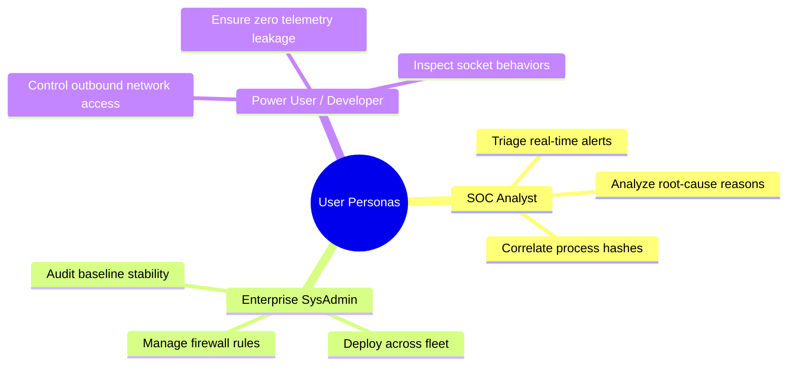
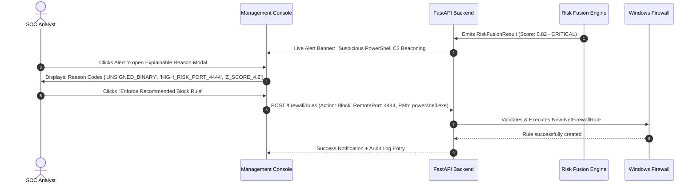

# Sentinel AI Firewall — Product Specification

## 1. Product Vision & Value Proposition

### 1.1 Vision Statement
Sentinel AI Firewall delivers an autonomous, privacy-preserving, zero-cloud endpoint security firewall that protects Windows workstations and servers from modern cyber threats, zero-day malware, and lateral movement using real-time behavioral AI and local-first adaptive learning.

### 1.2 Core Value Propositions
- **Total Privacy & Sovereignty**: Zero telemetry or packet inspection data leaves the customer's device.
- **Autonomous Anomaly Defense**: Detects novel threats without waiting for vendor signature updates.
- **Explainable Threat Decisions**: Every alert and rule recommendation presents verifiable empirical measurements and reasons.
- **Ultra-Lightweight Footprint**: Consistently operates under 150 MB RAM and $< 2\%$ CPU.

---

## 2. Target Personas

1. **SOC Analyst / Incident Responder**:
   - Needs rapid visibility into anomalous outbound connections, process parentage, and reason codes to isolate infected endpoints.
2. **Enterprise Systems Administrator**:
   - Requires deterministic firewall rule management, auditability, and zero false-positive service disruptions.
3. **Privacy-Conscious Power User / Developer**:
   - Desires total control over local network traffic without proprietary cloud telemetry agents consuming system resources.

---

## 3. Key Feature Specifications

### 3.1 Live Threat Dashboard
- **KPI Metrics Cards**:
  - Active Threat Level (LOW / MEDIUM / HIGH / CRITICAL)
  - Process Telemetry Ingestion Rate (events/sec)
  - Active Firewall Rule Inventory Count
  - Behavioral Baseline Identity Count & Confidence Average
- **Real-Time Event Stream**:
  - Live table of normalized `BehavioralEvent` records.
  - Interactive search and multi-criteria filters (by Process Name, Event Type, PID, Remote IP, Port).
  - Expandable row details displaying JSON-serializable explainable payloads and feature vectors.

### 3.2 AI Behavioral Baselining & Anomaly Engine
- **Online Adaptive Profiling**:
  - Tracks running mean and variance per `behavior_identity_key` using Welford's algorithm.
  - Visual baseline health indicators displaying observation count, maturity stage (`NEW`, `OBSERVING`, `KNOWN_BENIGN`), and variance stability.
- **Explainable Anomaly Alerts**:
  - Displays statistical $z$-scores for deviating metrics (e.g., unexpected byte rate, anomalous connection frequency).
  - Highlights novelty flags (`NEW_DESTINATION`, `UNUSUAL_PORT`, `UNEXPECTED_PROTOCOL`).

### 3.3 Windows Firewall Manager
- **Rule Inventory Table**:
  - Displays rule name, action (`Allow` / `Block`), direction (`Inbound` / `Outbound`), protocol, local/remote ports, and profile.
  - Interactive toggle switch to enable/disable rules instantly.
- **Rule Creation Modal**:
  - Form validation for rule name, port ranges, and protocols.
  - "Test Rule Impact" preview simulating potential connection blocks before applying.
- **Emergency Lockdown**:
  - Single-click global emergency mode restricting all non-whitelisted outbound traffic.

### 3.4 AI Security Assistant (Copilot)
- **Natural Language Query Interface**:
  - Allows users to ask: *"Why was chrome.exe connecting to port 4444 flagged?"* or *"Show me all unsigned executables active in the last 15 minutes."*
- **Context-Aware Recommendations**:
  - Translates natural language intent into actionable firewall rule proposals.

---

## 4. User Journey & Core Workflows

### 4.1 Alert Triage & Remediation Workflow

---

## 5. Non-Functional Specifications & Constraints

| Category | Specification | Target Metric |
| :--- | :--- | :--- |
| **Throughput** | Maximum telemetry ingestion capacity | $\ge 2,500\text{ events/sec}$ |
| **Inference Latency** | Feature extraction + Baseline + Anomaly evaluation | $< 2.5\text{ ms per event}$ |
| **Memory Footprint** | Combined backend + engine working memory | $< 150\text{ MB RAM}$ |
| **CPU Utilization** | Idle and typical continuous monitoring | $< 1.5\%\text{ (Core i5 or equivalent)}$ |
| **Firewall Sync** | Latency to apply dynamic rule to Windows OS | $< 350\text{ ms}$ |
| **Crash Recovery** | Maximum time to re-hydrate baselines from disk | $< 1.0\text{ second}$ |
| **Browser Support** | Modern Chromium, Gecko, WebKit (Chrome, Edge, Firefox) | Latest 2 major versions |

---

## 6. Success Metrics & Key Performance Indicators (KPIs)

1. **Threat Detection Rate (True Positive Rate)**: $\ge 98.5\%$ across standard MITRE ATT&CK C2 and exfiltration benchmarks.
2. **False Positive Rate (FPR)**: $< 0.1\%$ for standard legitimate business workflows after a 30-minute observation baseline period.
3. **Telemetry Privacy Integrity**: $100\%$ zero outbound network calls to external analytical servers.
4. **Time to Remediate (TTR)**: Under 5 seconds from alert generation to automated or single-click firewall rule activation.
