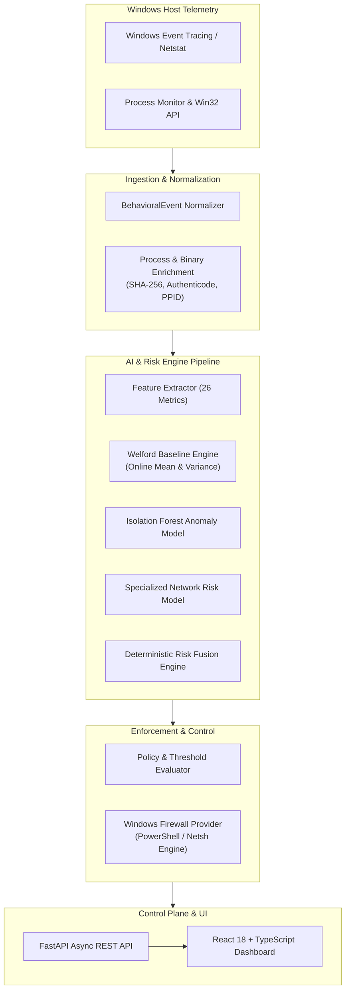

# Sentinel AI Firewall

[](https://www.python.org/downloads/)
[](https://fastapi.tiangolo.com)
[](https://reactjs.org/)
[](https://www.typescriptlang.org/)
[](https://opensource.org/licenses/MIT)
[](https://github.com/astral-sh/ruff)

**Sentinel AI Firewall** is an enterprise-grade, local-first, autonomous endpoint security and behavioral network firewall designed for Windows and modern hybrid environments. It combines kernel-level process telemetry, real-time statistical baselining, unsupervised machine learning anomaly detection, deterministic risk fusion, and automated firewall enforcement into an ultra-low-latency, privacy-preserving defense platform.

---

## Key Highlights

- 🧠 **Offline-First Adaptive Learning**: Continuous $O(1)$ statistical profiling via Welford accumulators without transmitting telemetry to external cloud servers.
- 🌲 **Hybrid Anomaly Detection**: Dual-tier evaluation fusing running $z$-score deviations with lightweight, localized scikit-learn Isolation Forests.
- ⚖️ **Deterministic Risk Fusion**: Mathematically bounded risk scoring (0.0 to 1.0) synthesized from process integrity, network indicators, and behavioral anomalies.
- 🛡️ **Baseline Poisoning Immunity**: Multi-stage learning state machine (`NEW` $\to$ `OBSERVING` $\to$ `KNOWN_BENIGN`) with immediate statistical freezes on anomalous or unverified telemetry.
- ⚡ **Zero Cloud Dependency**: Operates entirely in air-gapped or restricted environments with zero telemetry leakage.
- 🔍 **Explainable AI (XAI)**: Every alert and policy recommendation includes human-readable reason codes and empirical feature measurement breakdowns.
- 🖥️ **Modern Glassmorphic UI**: High-performance React 18 + TypeScript dashboard featuring real-time event streaming, threat visualization, rule management, and AI copilot investigation.

---

## System Architecture Overview



---

## Feature Matrix

| Capability | Sentinel AI Firewall | Traditional Endpoint Firewalls | Cloud-Native SASE/EDR |
| :--- | :--- | :--- | :--- |
| **Telemetry Privacy** | 100% Local / Zero Exfiltration | Local Only | Sent to Vendor Cloud |
| **Zero-Day Anomaly Detection** | Statistical $z$-Score + Isolation Forest | Static Port/IP Rules | Heavy Neural Cloud Inference |
| **Learning Adaptability** | Welford Online Accumulators | None (Manual Rules) | Retrained in Vendor Cloud |
| **Baseline Poisoning Defense** | Automatic Statistical Freezing | N/A | Heuristic Cloud Filters |
| **System Overhead** | $< 1.5\%$ CPU, $< 120\text{ MB RAM}$ | $< 1\%$ CPU | $5\%\text{--}15\%$ CPU |
| **Rule Synchronization** | Automated Local Windows Firewall | Manual Entry | Cloud Policy Agent |
| **Explainable Reason Codes** | Granular Empirical Evidence | Generic Port Match | Opaque Model Probabilities |

---

## Quick Start Guide

### Prerequisites

- **Operating System**: Windows 10/11 or Windows Server 2019/2022 (x86_64)
- **Python**: Python 3.11 or higher
- **Node.js**: Node.js 18.0+ & npm 9.0+
- **Privileges**: Administrator privileges (required for Windows Firewall management and deep packet telemetry)

### 1. Repository Setup

```bash
git clone https://github.com/RajOze/AI-Firewall.git
cd AI-Firewall
```

### 2. Backend Initialization

```bash
# Create and activate virtual environment
python -m venv .venv
.\.venv\Scripts\Activate.ps1

# Install backend dependencies
pip install -r requirements.txt -r requirements-dev.txt

# Start FastAPI backend service
uvicorn backend.app.main:app --host 127.0.0.1 --port 8000 --reload
```

The REST API will be available at:
- **API Base**: `http://127.0.0.1:8000`
- **Interactive Swagger Docs**: `http://127.0.0.1:8000/docs`
- **ReDoc Documentation**: `http://127.0.0.1:8000/redoc`

### 3. Frontend Dashboard Initialization

In a separate terminal:

```bash
cd frontend
npm install
npm run dev
```

Open your browser at `http://localhost:5173` to access the Sentinel AI Firewall Management Console.

---

## Documentation Directory

| Document | Purpose |
| :--- | :--- |
| [ARCHITECTURE.md](file:///e:/AI-Projects/AI-Firewall/ARCHITECTURE.md) | Comprehensive system architecture, component contracts, and data flows |
| [AI_ARCHITECTURE.md](file:///e:/AI-Projects/AI-Firewall/AI_ARCHITECTURE.md) | Deep dive into machine learning models, feature engineering, and inference |
| [ADAPTIVE_LEARNING.md](file:///e:/AI-Projects/AI-Firewall/ADAPTIVE_LEARNING.md) | Mathematical formulation of Welford baselines and poisoning mitigation |
| [RISK_ENGINE.md](file:///e:/AI-Projects/AI-Firewall/RISK_ENGINE.md) | Deterministic risk scoring equations, signal fusion, and confidence models |
| [SECURITY.md](file:///e:/AI-Projects/AI-Firewall/SECURITY.md) | Vulnerability disclosure, secure coding guidelines, and crypto standards |
| [THREAT_MODEL.md](file:///e:/AI-Projects/AI-Firewall/THREAT_MODEL.md) | STRIDE analysis, attack surface decomposition, and threat mitigations |
| [PRODUCT_SPEC.md](file:///e:/AI-Projects/AI-Firewall/PRODUCT_SPEC.md) | Product vision, functional specs, user personas, and acceptance criteria |
| [REQUIREMENTS.md](file:///e:/AI-Projects/AI-Firewall/REQUIREMENTS.md) | System requirements, latency targets, throughput, and hardware tiers |
| [ROADMAP.md](file:///e:/AI-Projects/AI-Firewall/ROADMAP.md) | Engineering roadmap from Phase 1 telemetry to Phase 4 autonomous mesh |
| [DEVELOPMENT.md](file:///e:/AI-Projects/AI-Firewall/DEVELOPMENT.md) | Developer setup, coding standards, test execution, and CI/CD workflows |
| [DEPLOYMENT.md](file:///e:/AI-Projects/AI-Firewall/DEPLOYMENT.md) | Production hardening, Windows service setup, and enterprise rollout |
| [TESTING.md](file:///e:/AI-Projects/AI-Firewall/TESTING.md) | Unit, integration, security, and performance test suites |
| [CHANGELOG.md](file:///e:/AI-Projects/AI-Firewall/CHANGELOG.md) | Chronological record of release milestones and major features |
| [COMPETITIVE_ANALYSIS.md](file:///e:/AI-Projects/AI-Firewall/COMPETITIVE_ANALYSIS.md) | Market positioning against legacy firewalls, EDRs, and SASE solutions |

---

## Repository Structure

```text
AI-Firewall/
├── backend/                  # FastAPI Core, Telemetry & Security Engine
│   ├── app/                  # REST API routers, models, services & dependencies
│   │   ├── api/              # Route handlers (/events, /firewall, /analyze)
│   │   ├── firewall/         # Windows Firewall rule providers & validators
│   │   ├── services/         # Telemetry aggregation & background workers
│   │   └── schemas/          # Pydantic schema definitions
│   └── security/             # AI & Risk Pipeline
│       ├── baseline.py       # Online Welford accumulators & state machine
│       ├── features.py       # 26-dimensional FeatureExtractor
│       ├── anomaly.py        # Isolation Forest & statistical z-score model
│       ├── network_risk.py   # Specialized network threat evaluator
│       ├── risk_fusion.py    # Deterministic multi-signal risk fusion
│       └── scoring.py        # Threat score & categorization engine
├── frontend/                 # React 18 + TypeScript + Vite Dashboard
│   ├── src/
│   │   ├── components/       # Reusable UI widgets & telemetry charts
│   │   ├── pages/            # Dashboard, Firewall, Alerts, AI Assistant
│   │   └── services/         # REST API clients & real-time hooks
├── network/                  # Socket monitoring, packet inspection & ETW
├── configs/                  # Environment & profile configuration files
├── docs/                     # Technical specifications & design records
├── tests/                    # Unit, integration, performance & security test suites
├── pyproject.toml            # Build configuration & tooling settings
└── requirements.txt          # Python dependencies
```

---

## Contributing

We welcome contributions from security researchers, systems engineers, and UI developers. Please review [CONTRIBUTING.md](file:///e:/AI-Projects/AI-Firewall/CONTRIBUTING.md) and [SECURITY.md](file:///e:/AI-Projects/AI-Firewall/SECURITY.md) before submitting pull requests.

---

## License

Sentinel AI Firewall is distributed under the terms of the [MIT License](file:///e:/AI-Projects/AI-Firewall/LICENSE).
