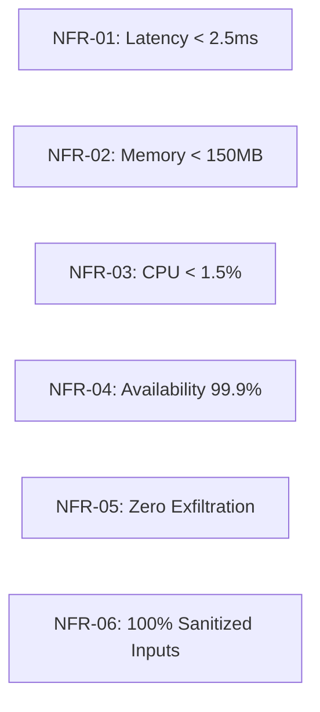

# Sentinel AI Firewall — Requirements Specification

## 1. System Requirements & Hardware Tiers

Sentinel AI Firewall is engineered for extreme efficiency, allowing deployment on constrained edge laptops up to multi-core enterprise server nodes.

| Specification | Minimum Tier | Recommended Production | Enterprise Server |
| :--- | :--- | :--- | :--- |
| **CPU** | Dual-core 2.0 GHz (x86_64) | Quad-core 2.8+ GHz (x86_64) | 8+ cores (x86_64) |
| **RAM** | 2 GB Total (250 MB Allocated) | 8 GB Total (500 MB Allocated) | 16+ GB Total |
| **Disk Space** | 200 MB Available | 1 GB Available (SSD) | 5 GB Available (NVMe SSD) |
| **Operating System** | Windows 10 (Version 20H2+) | Windows 11 / Windows Server 2022 | Windows Server 2022 Datacenter |
| **Python Runtime** | Python 3.11.0+ | Python 3.12.x | Python 3.12.x (Optimized CPython) |
| **Node.js (UI)** | Node.js 18.16+ & npm 9.5+ | Node.js 20.x LTS | Node.js 20.x LTS |
| **Privileges** | Local Administrator (UAC) | Elevated System Service / Admin | Managed Service Account (gMSA) |

---

## 2. Functional Requirements (FR)

### FR-01: Real-Time Network & Process Telemetry Ingestion
- **Description**: The system must capture active host TCP and UDP socket events and associate each with process metadata.
- **Inputs**: Host socket state changes, IP/Port endpoints, process PIDs.
- **Outputs**: Normalized `BehavioralEvent` dataclass objects.
- **Error Handling**: Gracefully handle transient socket closures and restricted system processes (`PID 0`, `PID 4`) without throwing exceptions.

### FR-02: Cryptographic Binary & Authenticode Enrichment
- **Description**: The system must compute the SHA-256 hash and verify Authenticode digital signatures for every executable initiating network connections.
- **Inputs**: Absolute file system path of binary.
- **Outputs**: `ProcessInfo` containing `sha256`, `is_signed`, `publisher`, and `is_elevated`.
- **Error Handling**: Cache results in an LRU memory cache; fall back to safe default flags if binary disk access is locked.

### FR-03: Feature Vector Normalization
- **Description**: The system must transform raw events into a 26-dimensional numerical vector adhering to feature version `1.0`.
- **Inputs**: `BehavioralEvent` and historical connection counts.
- **Outputs**: `FeatureVector` object with `.to_numpy()` array export.
- **Error Handling**: Impute missing features with deterministic neutral defaults (e.g. `bytes_sent_log = 0.0`, `signed_status = 0.5`).

### FR-04: Welford Online Behavioral Baselining
- **Description**: The system must maintain running mean and variance per `behavior_identity_key` using Welford's algorithm in $O(1)$ time and memory.
- **Lifecycle States**: Progress identities across `NEW` $\to$ `OBSERVING` $\to$ `KNOWN_BENIGN`.
- **Poisoning Defense**: Halt baseline updates immediately if an incoming event produces an anomaly score $\ge 0.7$.

### FR-05: Hybrid Anomaly Detection
- **Description**: The system must compute a combined anomaly score ($[0.0, 1.0]$) using statistical $z$-score deviations and scikit-learn Isolation Forest inference.
- **Outputs**: `AnomalyResult` with `anomaly_score`, `confidence`, `deviating_features`, and `reason_codes`.

### FR-06: Deterministic Risk Fusion
- **Description**: The system must fuse anomaly scores, process security indicators, and network risk signals into a single normalized `RiskFusionResult`.
- **Formula**: $\text{Risk} = 0.40 \cdot \text{Anomaly} + 0.35 \cdot \text{Process} + 0.25 \cdot \text{Network}$.
- **Tiers**: Categorize into `LOW`, `MEDIUM`, `HIGH`, or `CRITICAL`.

### FR-07: Windows Firewall Rule Enforcement
- **Description**: The system must query, create, enable, disable, and delete rules in the native Windows Firewall.
- **Validation**: Enforce strict regex validation (`^[a-zA-Z0-9_\-\. ]+$`) on rule names and integer bounds ($0\text{--}65535$) on ports.
- **Safety**: Provide atomic rollback capabilities.

### FR-08: REST API Control Plane
- **Description**: Provide asynchronous REST endpoints (`/events`, `/events/stats`, `/events/baseline`, `/firewall/rules`, `/analyze`) with CORS restriction to localhost.

### FR-09: Live Management Dashboard
- **Description**: Deliver a web interface built with React 18 and TypeScript rendering live metrics, event feeds, baseline status, and rule management forms.

### FR-10: AI Security Assistant
- **Description**: Support interactive natural language queries to inspect historical security events and propose firewall rules.

---

## 3. Non-Functional Requirements (NFR)

### NFR-01: Performance & Latency
- The end-to-end processing pipeline from telemetry ingestion to risk scoring must complete in $< 2.5\text{ ms}$ for 99% of events ($p99$).

### NFR-02: Memory Constraints
- Total resident memory (RSS) of the backend Python process must not exceed $150\text{ MB}$ under steady-state operation of 20,000 tracked behavioral identities.

### NFR-03: CPU Overhead
- Idle CPU usage must remain below $0.5\%$; peak processing under continuous high network load ($1,000\text{ connections/sec}$) must remain $< 2.5\%$ CPU.

### NFR-04: Reliability & Fault Tolerance
- Telemetry worker failures must automatically recover without crashing the FastAPI application.
- State serialization must ensure clean baseline recovery within $< 1.0\text{ second}$ of service restart.

### NFR-05: Privacy & Zero Exfiltration
- No raw telemetry, host IP addresses, process names, or analytical vectors shall be transmitted outside `127.0.0.1`.

### NFR-06: Security & Input Hardening
- 100% of external inputs passed to shell or PowerShell commands must be sanitized against injection attacks.

### NFR-07: Portability & Modularity
- Core ML models and baseline engines must remain decoupled from Windows-specific APIs, allowing future cross-platform Linux (eBPF/nftables) integration.

### NFR-08: Maintainability & Code Quality
- All Python codebase must pass `ruff` with 0 errors and maintain $\ge 85\%$ automated unit and integration test coverage.
