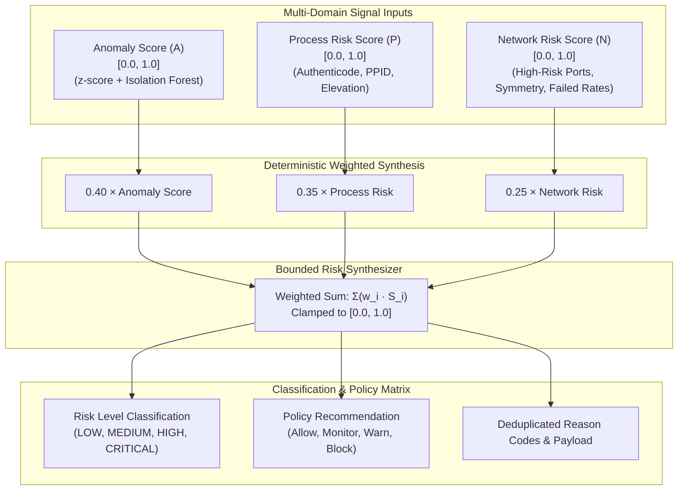

# Sentinel AI Firewall — Deterministic Risk Engine & Signal Fusion

## 1. Executive Summary

The **Risk Fusion Engine** (`RiskFusionEngine`) synthesizes multi-dimensional security signals across behavioral anomalies, host process trustworthiness, and network connection characteristics into a single, bounded, explainable threat assessment.

By employing deterministic weighted mathematics rather than opaque stochastic neural networks, the risk engine guarantees reproducibility, predictable policy enforcement, and auditability required for enterprise cyber defense.

---

## 2. Risk Engine Architecture & Mathematical Formulation

Path: `backend/security/risk_fusion.py`



---

## 3. Mathematical Formulation

### 3.1 Composite Weighted Risk Equation
The unified risk score $R \in [0.0, 1.0]$ is computed as:

$$R = \min\Big(1.0,\; \max\big(0.0,\; 0.40 \cdot A + 0.35 \cdot P + 0.25 \cdot N\big)\Big)$$

Where:
- $A \in [0.0, 1.0]$: Fused anomaly score from `AnomalyDetectionEngine` (statistical $z$-score + Isolation Forest ML score).
- $P \in [0.0, 1.0]$: Process risk score calculated from binary image integrity.
- $N \in [0.0, 1.0]$: Network risk score computed from destination port and traffic characteristics.

---

### 3.2 Component 1: Process Risk Score ($P$)
Evaluates the execution context and cryptographic identity of the host binary:

$$P = \min\Big(1.0,\; \delta_{\text{unsigned}} + \delta_{\text{publisher}} + \delta_{\text{elevated}} + \delta_{\text{restricted}}\Big)$$

| Process Risk Factor | Weight ($\delta$) | Trigger Condition | Reason Code |
| :--- | :---: | :--- | :--- |
| **Unsigned Executable** | $+0.35$ | Binary lacks valid Windows Authenticode digital signature | `UNSIGNED_EXECUTABLE` |
| **Unknown Publisher** | $+0.20$ | Certificate lacks a verified commercial publisher identity | `UNKNOWN_PUBLISHER` |
| **Elevated Process Token** | $+0.15$ | Process runs with Administrator / System privileges | `ELEVATED_PROCESS` |
| **Restricted / Hidden Process** | $+0.15$ | Process memory or path inspection was denied by OS | `RESTRICTED_ACCESS_PROCESS` |

---

### 3.3 Component 2: Network Risk Score ($N$)
Evaluates destination endpoint hazard, known C2 ports, and connection patterns:

$$N = \min\Big(1.0,\; \delta_{\text{port}} + \delta_{\text{diversity}} + \delta_{\text{symmetry}}\Big)$$

#### High-Risk Port Catalog (`HIGH_RISK_PORTS`)
Access to any of the following ports immediately applies $\delta_{\text{port}} = +0.30$ and appends reason code `SUSPICIOUS_PORT`:

```text
High-Risk Ports = {
    21 (FTP), 22 (SSH), 23 (Telnet), 
    135 (MS-RPC), 137 (NetBIOS-NS), 138 (NetBIOS-DGM), 139 (NetBIOS-SSN), 445 (SMB), 
    1433 (MS-SQL), 1521 (Oracle DB), 3306 (MySQL), 3389 (RDP), 
    4444 (Metasploit Listener), 5900 (VNC), 6667 (IRC C2), 8080 (HTTP-Alt Proxy)
}
```

---

### 3.4 Component 3: Anomaly Score ($A$)
Aggregates statistical $z$-score distance ($A_{\text{stat}}$) from Welford baselines and unsupervised Isolation Forest inference ($A_{\text{ml}}$):

$$A = \begin{cases} 
0.60 \cdot A_{\text{stat}} + 0.40 \cdot A_{\text{ml}} & \text{if ML model is available} \\ 
A_{\text{stat}} & \text{if ML model is offline} 
\end{cases}$$

---

## 4. Risk Level Tiers & Policy Matrix

| Risk Score Range ($R$) | Risk Level Tier | Recommendation | Automated System Action |
| :---: | :---: | :---: | :--- |
| **$0.00 \le R < 0.25$** | **`LOW`** | `Allow` | Permit connection; update Welford baseline statistics. |
| **$0.25 \le R < 0.50$** | **`MEDIUM`** | `Monitor` | Permit connection; log event; observe behavioral evolution. |
| **$0.50 \le R < 0.75$** | **`HIGH`** | `Warn` | Flag interactive alert on UI; highlight reason codes; freeze baseline. |
| **$0.75 \le R \le 1.00$** | **`CRITICAL`** | `Block` | Freeze baseline; trigger dynamic Windows Firewall quarantine rule. |

---

## 5. Confidence Calculation & Decoupling

To ensure that high anomaly scores on un-baselined events do not trigger false positives, confidence ($C \in [0.0, 1.0]$) is computed independently:

$$C = \min\Big(1.0,\; \max\big(0.0,\; 0.40 \cdot C_{\text{rep}} + 0.60 \cdot C_{\text{baseline}}\big)\Big)$$

Where:
- $C_{\text{rep}}$: Certainty of process certificate and reputation analysis.
- $C_{\text{baseline}}$: Maturity confidence of the Welford baseline accumulator ($0.10$ for `NEW`, $0.50$ for `OBSERVING`, $1.00$ for `KNOWN_BENIGN`).

---

## 6. Standardized Output Contract (`RiskFusionResult`)

```json
{
  "risk_score": 0.82,
  "risk_level": "CRITICAL",
  "confidence": 0.88,
  "recommendation": "Block",
  "anomaly_score": 0.78,
  "process_risk": 0.70,
  "network_risk": 0.30,
  "reason_codes": [
    "UNSIGNED_EXECUTABLE",
    "UNKNOWN_PUBLISHER",
    "SUSPICIOUS_PORT",
    "ANOMALOUS_BYTE_RATE"
  ],
  "explainable_payload": {
    "process_name": "mimikatz.exe",
    "remote_target": "185.220.101.5:4444",
    "z_score_deviation": 4.25,
    "welford_mean_bytes": 1042.0,
    "observed_bytes": 845200.0
  }
}
```
