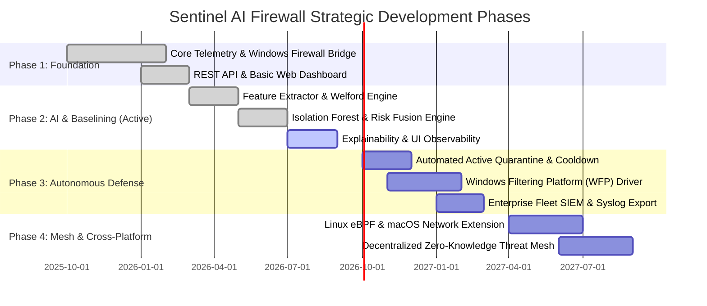

# Sentinel AI Firewall — Product & Engineering Roadmap

## 1. Roadmap Overview & Strategic Vision

The development of Sentinel AI Firewall is structured into four strategic phases, transitioning from foundational host telemetry to fully autonomous, cross-platform behavioral endpoint defense.

---

## 2. Phase Breakdown & Deliverables

### Phase 1: Core Telemetry & Firewall Management (Completed)
- [x] Native Windows socket discovery and background polling.
- [x] Process attribution (PID, PPID, executable path resolution).
- [x] Authenticode digital signature verification and SHA-256 binary hashing.
- [x] Idempotent Windows Firewall rule provider via PowerShell and `netsh`.
- [x] Strict input validation regex to eliminate command injection.
- [x] FastAPI asynchronous backend core and in-memory ring buffer.
- [x] React + TypeScript dashboard with live telemetry table and rule manager.

---

### Phase 2: Behavioral Baselining & Offline AI Anomaly Detection (Current Milestone)
- [x] **P2.1 Behavioral Event Contract**: Standardized `BehavioralEvent` dataclass.
- [x] **P2.2 Feature Extraction Engine**: 26-dimensional numerical vector calculation with categorical encoding.
- [x] **P2.3 Welford Baseline Engine**: Online single-pass mean and variance calculation per `behavior_identity_key`.
- [x] **P2.3 Baseline Poisoning Protection**: Dynamic statistical freeze on anomalous telemetry ($\text{anomaly} \ge 0.7$).
- [x] **P2.4 Hybrid Anomaly Detection**: Statistical $z$-score deviation combined with scikit-learn `IsolationForest`.
- [x] **P2.5 Specialized Network Risk Model**: Evaluation of suspicious ports, novel endpoints, and traffic symmetry.
- [x] **P2.5 Deterministic Risk Fusion**: Multi-signal threat weighting ($40\% \text{ Anomaly} + 35\% \text{ Process} + 25\% \text{ Network}$).
- [x] **P2.6 REST Observability Endpoints**: `/events/stats` and `/events/baseline` summary endpoints.
- [ ] **P2.7 Automated Baseline Persistence**: Scheduled background snapshot serialization to encrypted local disk.

---

### Phase 3: Autonomous Active Enforcement & Enterprise Readiness (Upcoming)
- [ ] **Automated Active Quarantine**: Transition from observation/warning mode to autonomous block rule synthesis for `CRITICAL` threats.
- [ ] **Dynamic Cooldown & Rollback**: Automatic expiration of transient quarantine rules after configurable timeout (e.g., 30 minutes) if threat behavior ceases.
- [ ] **Kernel-Level WFP Callout Driver**: Transition socket interception to native Windows Filtering Platform (WFP) kernel driver for sub-microsecond packet drops.
- [ ] **Offline Threat Intelligence Feeds**: Local SQLite/DuckDB cache of verified malicious indicators (C2 IPs, compromised domains) with periodic offline updates.
- [ ] **SIEM & Syslog Exporter**: Structured CEF/LEEF/JSON log streaming to Splunk, Microsoft Sentinel, and Elastic.
- [ ] **Multi-Endpoint Fleet Orchestration**: Centralized management agent for distributed enterprise workstation deployments.

---

### Phase 4: Cross-Platform & Decentralized Mesh Defense (Long-Term Vision)
- [ ] **Linux eBPF / XDP Subsystem**: Native Linux behavioral capture and `nftables` enforcement using kernel eBPF probes.
- [ ] **macOS NetworkExtension**: Modern endpoint security integration via Apple Endpoint Security API.
- [ ] **Zero-Knowledge Threat Mesh**: Privacy-preserving federated sharing of novel attack signatures across peer endpoints without sharing local IP or process identity.
- [ ] **Autonomous LLM Incident Explainer**: On-device quantized local LLM (via ONNX / llama.cpp) generating deep contextual forensic reports.

---

## 3. Release Milestones & Target Dates

| Release Milestone | Target Date | Key Focus |
| :--- | :--- | :--- |
| **v0.1.0-alpha** | Q1 2026 (Delivered) | Core Telemetry, Windows Firewall Rule Provider, React Dashboard |
| **v0.2.0-beta** | Q3 2026 (Active) | Welford Baselining, Isolation Forest ML, Risk Fusion, Explainable AI |
| **v0.3.0-rc1** | Q4 2026 | Autonomous Quarantine, Dynamic Cooldown, Local Baseline Persistence |
| **v1.0.0-GA** | Q1 2027 | Enterprise Hardening, WFP Driver, SIEM Integration, Installer Package |
| **v2.0.0-GA** | Q3 2027 | Cross-Platform (Linux/macOS), Federated Threat Mesh |
