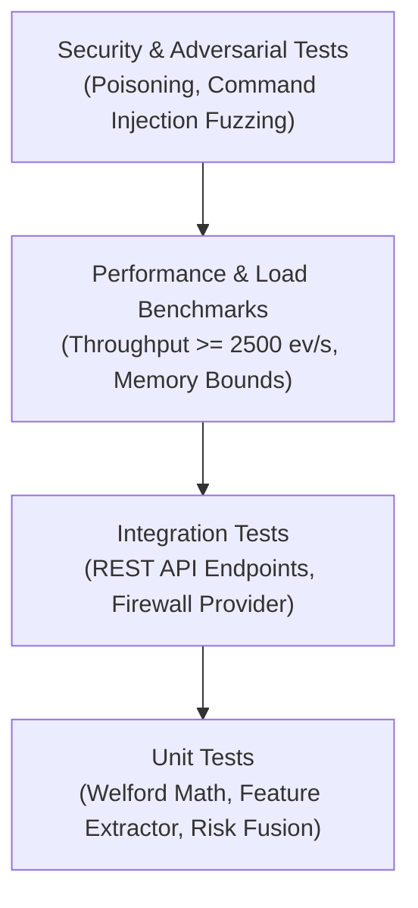

# Sentinel AI Firewall — Testing & Quality Assurance Guide

## 1. Testing Philosophy & Test Pyramid

The Sentinel AI Firewall test suite enforces rigorous mathematical accuracy, memory safety, command injection immunity, and high-throughput execution.



---

## 2. Test Suite Directory Structure

```text
tests/
├── unit/                         # Fast, isolated unit tests (< 50ms per test)
│   ├── api/                      # Router & schema validation tests
│   ├── dependencies/             # Dependency injection fixture tests
│   ├── firewall/                 # Rule validator & provider tests
│   │   ├── test_validator.py     # Regex & port boundary validation
│   │   └── test_service.py       # Rule lifecycle orchestration
│   ├── models/                   # Dataclass serialization tests
│   ├── network/                  # Socket parsing & enrichment tests
│   ├── security/                 # AI & statistical engine unit tests
│   │   ├── test_baseline.py      # Welford accumulator & state transition tests
│   │   ├── test_features.py      # 26-D feature vector extraction tests
│   │   ├── test_anomaly.py       # Isolation Forest & z-score tests
│   │   ├── test_network_risk.py  # Network threat scoring tests
│   │   └── test_risk_fusion.py   # Deterministic weighted fusion tests
│   └── telemetry/                # Ring buffer & ingestion tests
├── integration/                  # End-to-end service & API tests
│   ├── test_events_api.py        # Telemetry query & stats endpoints
│   └── test_firewall_api.py      # Firewall listing & rule management
├── security/                     # Adversarial & fuzzing test suites
│   ├── test_command_injection.py # Shell injection payload validation
│   └── test_poisoning_defense.py # Statistical freeze under anomaly attack
└── performance/                  # Throughput, latency & memory benchmarks
    └── test_throughput.py        # 10,000 event continuous load benchmark
```

---

## 3. Running the Test Suites

### 3.1 Executing All Tests with Coverage Report

```powershell
# Run the complete test suite with coverage
pytest --cov=backend --cov=network tests/ -v
```

### 3.2 Executing Specific Test Subsets

```powershell
# Run unit tests only
pytest tests/unit/ -v

# Run AI and baseline engine tests specifically
pytest tests/unit/security/ -v

# Run security and adversarial tests
pytest tests/security/ -v

# Run performance benchmarks with stdout output
pytest tests/performance/ -v -s
```

### 3.3 Target Coverage & Thresholds
- **Overall Code Coverage Target**: $\ge 85\%$
- **Security & Validator Modules**: $100\%$ branch coverage mandated.

---

## 4. Key Test Categories & Verification Focus

### 4.1 Welford Statistical Baseline Tests (`test_baseline.py`)
- **Mathematical Accuracy**: Validates that Welford running mean ($\bar{x}$) and running variance ($\sigma^2$) match exact NumPy computations across $10,000$ random samples to within $10^{-6}$ precision.
- **State Machine Transitions**: Verifies proper status transitions:
  - Observations $< 3 \to \text{NEW}$
  - Observations $3\text{--}4 \to \text{OBSERVING}$
  - Observations $\ge 5 \text{ and } \text{anomaly} < 0.5 \to \text{KNOWN\_BENIGN}$
- **Poisoning Defense & Statistical Freeze**: Confirms that sending events with anomaly score $\ge 0.7$ results in **zero updates** to accumulator counts, means, or variances.

```python
# Example test snippet from tests/unit/security/test_baseline.py
def test_welford_statistical_freeze_on_anomaly():
    engine = BehavioralBaselineEngine()
    key = "powershell.exe|C:\\powershell.exe|10.0.0.1:4444|TCP|OUTBOUND"
    
    # Establish benign state
    for _ in range(5):
        engine.observe(create_sample_feature_vector(key))
    
    initial_mean = engine.get_record(key).metrics["bytes_sent_log"].mean
    
    # Introduce high anomaly observation (attack traffic)
    attack_vector = create_sample_feature_vector(key, bytes_sent=10_000_000)
    engine.observe(attack_vector, anomaly_score=0.85)
    
    # Assert accumulator was frozen
    frozen_mean = engine.get_record(key).metrics["bytes_sent_log"].mean
    assert frozen_mean == initial_mean
```

### 4.2 Firewall Command Injection Fuzzing (`test_command_injection.py`)
Tests hundreds of malicious string payloads against `validate_rule_name()` and port validators:
- `TestRule; rm -rf /`
- `Rule | calc.exe`
- `Rule && New-NetFirewallRule`
- `Rule\nPayload`
- **Expected Outcome**: 100% of payloads raise `FirewallValidationError`.

### 4.3 Deterministic Risk Fusion Verification (`test_risk_fusion.py`)
- Tests boundary conditions: All zero inputs $\to 0.0$ risk, `LOW`, `Allow`.
- High anomaly + unsigned process + high-risk port $4444 \to \ge 0.85$ risk, `CRITICAL`, `Warn/Block`.
- Verifies explainable reason codes are accurately collected and deduplicated.

### 4.4 Ingestion Throughput Benchmarks (`test_throughput.py`)
- Emits $10,000$ synthetic `BehavioralEvent` objects through the pipeline.
- Measures events processed per second ($\ge 2,500\text{ ev/s}$ target) and $p95 / p99$ latency ($< 2.5\text{ ms}$).

---

## 5. Writing New Test Cases

### 5.1 Test Guidelines
1. **Deterministic Execution**: Avoid non-deterministic external network calls or wall-clock dependencies; use fixtures or freeze time.
2. **Standardized Fixtures**: Leverage pre-configured `BehavioralEvent` and `FeatureVector` factory fixtures.
3. **Parametrization**: Use `@pytest.mark.parametrize` for boundary value testing.

```python
import pytest
from backend.app.firewall.validator import validate_port, FirewallValidationError

@pytest.mark.parametrize("invalid_port", [-1, 65536, "80", 100000, -50])
def test_invalid_port_raises_validation_error(invalid_port):
    with pytest.raises(FirewallValidationError):
        validate_port(invalid_port)
```
