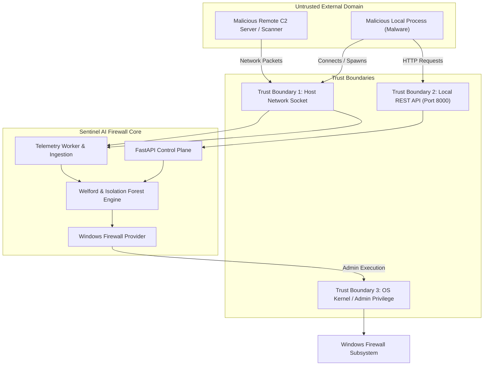

# Sentinel AI Firewall — Threat Model & STRIDE Analysis

## 1. System Overview & Scope

The purpose of this threat model is to systematically evaluate potential attack vectors against **Sentinel AI Firewall**, analyze threats using the **STRIDE** methodology, define defensive mitigations, and quantify residual risks.

The scope encompasses:
- Local network socket monitoring and telemetry collection.
- Process enrichment and Authenticode verification subsystems.
- Online Welford baseline statistical accumulators and Isolation Forest ML models.
- FastAPI REST control plane and IPC boundaries.
- Windows Firewall provider (`netsh` / PowerShell execution bridges).
- Local state persistence and configuration files.

---

## 2. Threat Actor Personas

| Threat Actor | Motivation | Capabilities | Target Vector |
| :--- | :--- | :--- | :--- |
| **Commodity Malware / Ransomware** | Fast propagation, encryption, C2 beaconing | High-volume network scanning, un-signed payloads, default C2 ports (4444, 6667) | Network connections, socket flooding |
| **Advanced Persistent Threat (APT)** | Espionage, persistence, data exfiltration | Slow-drip exfiltration, Living-off-the-Land Binaries (LOLBins), process hollowing | Adaptive baseline poisoning, mimicry |
| **Malicious Local User / Insider** | Sabotage, privilege escalation | Local shell access, non-admin permissions | REST API manipulation, command injection |
| **Adversarial ML Attacker** | Evading anomaly detection | Gradual perturbation of connection frequencies and packet sizes | Welford variance dilation, contamination |

---

## 3. Attack Surface Decomposition

---

## 4. STRIDE Threat Analysis & Mitigations

### 4.1 Spoofing (Identity Impersonation)

| Threat ID | Threat Scenario | Impact | Severity | Defensive Mitigation |
| :--- | :--- | :--- | :--- | :--- |
| **TM-S1** | **Process Masquerading**: Malware names itself `svchost.exe` or `chrome.exe` to inherit trusted baseline status. | High | **High** | Telemetry does not rely solely on process names. The system computes binary **SHA-256 hashes**, inspects full disk executable paths, and validates Authenticode digital signatures. |
| **TM-S2** | **PID Reuse Race Condition**: A malicious process quickly reuses a terminated trusted PID to fool telemetry attribution. | Medium | **Medium** | Process start and stop events are correlated with high-resolution timestamps and verified against parent PID (PPID) chains. |
| **TM-S3** | **API Caller Spoofing**: An unauthorized local application sends forged telemetry directly to the REST API. | Medium | **Medium** | REST API is bound strictly to `127.0.0.1`. Telemetry ingestion originates from internal memory buffers, not untrusted HTTP endpoints. |

---

### 4.2 Tampering (Data & Model Manipulation)

| Threat ID | Threat Scenario | Impact | Severity | Defensive Mitigation |
| :--- | :--- | :--- | :--- | :--- |
| **TM-T1** | **Baseline Poisoning**: Adversary generates slow, incremental anomalous connections to skew Welford mean and variance metrics. | High | **High** | **Statistical Freeze**: Observations triggering an anomaly score $\ge 0.7$ or marked `SUSPICIOUS` are frozen from updating baseline accumulators. Observation thresholds require multi-step maturation before reaching `KNOWN_BENIGN`. |
| **TM-T2** | **Model Serial File Tampering**: Attacker replaces serialized joblib model files on disk with compromised classifiers. | Critical | **High** | Serialized ML models include cryptographic schema version checks and are stored in administrator-protected system directories with restrictive ACLs. |
| **TM-T3** | **Firewall Rule Tampering**: An external tool or malicious script deletes rules created by Sentinel AI Firewall. | Medium | **Medium** | Periodic reconciliation loop verifies active Windows Firewall rules against the local state inventory and re-applies missing quarantine rules. |

---

### 4.3 Repudiation (Action Concealment)

| Threat ID | Threat Scenario | Impact | Severity | Defensive Mitigation |
| :--- | :--- | :--- | :--- | :--- |
| **TM-R1** | **Log Erasure / Evasion**: Malware suppresses socket events or attempts to purge local event logs. | Medium | **Medium** | Telemetry events are stored in bounded in-memory ring buffers and streamed asynchronously to append-only local rotating logs. |
| **TM-R2** | **Un-attributed Connection Events**: Transient ephemeral UDP sockets open and close too rapidly for attribution. | Low | **Low** | Socket polling operates at low millisecond sampling intervals; un-attributed sockets are assigned conservative default risk baselines with low confidence. |

---

### 4.4 Information Disclosure (Data Leakage)

| Threat ID | Threat Scenario | Impact | Severity | Defensive Mitigation |
| :--- | :--- | :--- | :--- | :--- |
| **TM-I1** | **Sensitive Telemetry Exposure via API**: Unprivileged local processes read detailed host network traffic and connection history from `/events`. | Medium | **Medium** | CORS is locked to authorized local frontend origins (`http://localhost:5173`). In production deployments, localhost token authentication (JWT/API Key) restricts access. |
| **TM-I2** | **Cloud Exfiltration Vulnerability**: Third-party monitoring vendors or cloud connectors leak corporate packet data. | Critical | **Zero (N/A)** | **Zero Cloud Design**: By architectural mandate, no telemetry or packet inspection data is ever sent across WAN or cloud connections. |

---

### 4.5 Denial of Service (Resource Exhaustion)

| Threat ID | Threat Scenario | Impact | Severity | Defensive Mitigation |
| :--- | :--- | :--- | :--- | :--- |
| **TM-D1** | **Connection Flooding / Buffer Exhaustion**: Malware rapidly creates thousands of synthetic sockets per second to exhaust host RAM. | High | **High** | Ingestion ring buffers are strictly bounded (e.g. 5,000 max events). Overflows drop oldest unclassified events gracefully while raising an aggregate flood alarm. |
| **TM-D2** | **Welford Memory Growth**: Adversary connects to millions of unique IP addresses to create millions of baseline accumulators. | High | **Medium** | Baseline memory uses an LRU eviction policy capping maximum tracked behavioral keys (e.g., 20,000 identities), purging oldest inactive profiles. |
| **TM-D3** | **FastAPI Thread Starvation**: Blocking system calls in rule creation lock the async event loop. | High | **High** | All firewall system operations (`netsh` / PowerShell) are executed asynchronously in dedicated thread pools using `anyio.to_thread` or non-blocking subprocesses. |

---

### 4.6 Elevation of Privilege (Unauthorized Execution)

| Threat ID | Threat Scenario | Impact | Severity | Defensive Mitigation |
| :--- | :--- | :--- | :--- | :--- |
| **TM-E1** | **Command Injection in Firewall Provider**: Attacker passes crafted rule names (e.g., `Rule1 & calc.exe`) to execute arbitrary commands as Administrator. | Critical | **Critical** | **Strict Regex & Typed Sanitization**: All inputs pass `^[a-zA-Z0-9_\-\. ]+$` validation. Commands are executed via parameterized arguments without invoking raw shell interpreters. |
| **TM-E2** | **UAC Bypass / Privilege Elevation**: Non-admin user attempts to force rule creation via REST API. | High | **High** | Firewall execution checks administrative token privileges. If executed without elevation, the system fails securely with a structured `PermissionError` without modifying rules. |

---

## 5. Residual Risk & Acceptance Matrix

| Risk ID | Residual Risk Description | Risk Level | Mitigation Strategy / Acceptance Rationale |
| :--- | :--- | :--- | :--- |
| **RR-01** | Kernel-level rootkits bypassing user-mode Windows socket APIs. | Medium | Accepted: Sentinel operates in user-mode; complementary to OS kernel defenses (HVCI/Secure Boot). |
| **RR-02** | Cold-start period where newly installed applications lack baseline history. | Low | Mitigated: Multi-stage confidence scoring ensures new apps are monitored closely with low confidence without premature blocking. |
| **RR-03** | Encrypted packet payloads concealing application-layer data. | Low | Accepted: Firewall focuses on transport, process, and behavioral metadata rather than deep TLS termination. |
